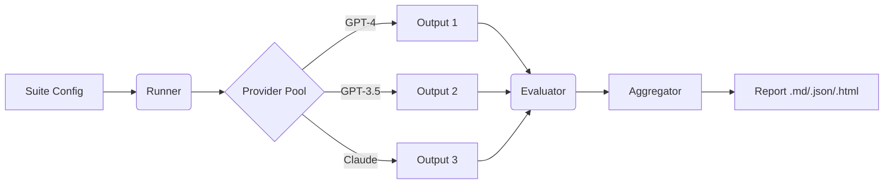

# PromptLint
> **The CI/CD for Prompts.**
> Ship robust prompts with confidence by stress-testing them across model ladders and temperature ranges.

[](https://www.python.org/downloads/)
[](https://opensource.org/licenses/MIT)

**PromptLint** helps you engineer prompts that are not just "good enough" for one model, but **robust** across many. It evaluates consistency, stability, and format adherence, ensuring your prompts transfer well between models and don't break under sampling variations.

---

## 🚀 Why PromptLint?

- **📉 The Model Ladder**: Don't just test on GPT-4. Verify your prompt works on cheaper/faster models (e.g., GPT-3.5, small OSS models) to save costs without sacrificing reliability.
- **🧬 Semantic Consistency**: Beyond exact matches. Uses embedding similarity to check if different models mean the same thing, even if the words differ.
- **🛡 Constraint Guards**: Automatically enforce JSON schemas, bullet counts, regex patterns, and more.
- **⚡️ Async & Cached**: built for speed. Run massive suites concurrently with automatic caching to save API costs.

---

## 🛠 How it Works



1.  **Define a Suite**: Configure your prompt, constraints, and the "ladder" of models to test.
2.  **Run**: PromptLint executes prompts across all defined models and temperatures (e.g., T=0.0 to 1.0).
3.  **Score**: Outputs are scored for **Format Adherence** (Does it look right?) and **Consistency** (Is it stable?).
4.  **Report**: Get a detailed report highlighting where your prompt becomes unstable.

---

## ⚡️ Quick Start

### Installation

```bash
pip install -e .
```

### Run Your First Suite

1.  Set your API key:
    ```bash
    export OPENAI_API_KEY=sk-...
    ```

2.  Run the example suite:
    ```bash
    promptlint --suite examples/suite.yaml --report report.html --report-format html
    ```

3.  Open `report.html` to see your robustness scores!

---

## 🧩 Configuration

The core of PromptLint is the `suite.yaml`. Here is a conceptual example:

```yaml
# 1. Define Providers
providers:
  - name: "openai"
    kind: "openai_compatible"
    api_key_env: "OPENAI_API_KEY"

# 2. Define the Model Ladder (Tiers)
ladder:
  - name: "gpt-4o"
    provider: "openai"
    tier: 1  # Reference model
  - name: "gpt-3.5-turbo"
    provider: "openai"
    tier: 2  # Cheaper alternative

# 3. Sampling Strategy
sampling:
  - temperature: 0.0
  - temperature: 0.7  # Test stability under noise

# 4. Prompts & Constraints
prompts:
  - id: "summarize_email"
    text: "Summarize this email in 3 bullet points: {{email_body}}"
    constraints:
      - name: "format_check"
        description: "Must be a list"
        rules:
           type: "count"
           pattern: "^\\s*[-*]"
           min: 3
```

---

## 📊 Metrics

PromptLint focuses on structural and semantic robustness, not just "is this fact true?".

Aggregation uses a weighted geometric mean plus a stability penalty to avoid hiding weak components.

| Metric | What it measures |
| :--- | :--- |
| **Constraint Adherence** | Do outputs satisfy explicit rules (Regex, JSON, Length)? |
| **Cross-Model Consistency** | do `GPT-4` and `GPT-3.5` say the same thing? (Text + Embedding Similarity) |
| **Temperature Stability** | Does the output change drastically when Temperature increases? |
| **Task Alignment** | Does the output format match the `expected_format` metadata? |
| **Success Rate** | How many runs succeeded without provider errors? |

---

## 🧪 Tests

We believe in reliable tools. Run the test suite (Unit & Integration) to verify logic:

```bash
# Install test dependencies generally implied
python -m unittest discover tests
```

## License

MIT
