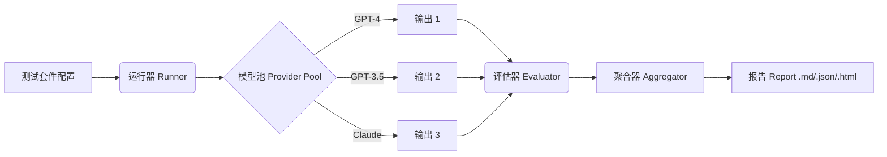

# PromptLint
> **Prompt 的 CI/CD 工具。**
> 通过在模型阶梯和不同温度范围内进行压力测试，充满自信地交付鲁棒的 Prompt。

[](https://www.python.org/downloads/)
[](https://opensource.org/licenses/MIT)

**PromptLint** 帮助您设计不仅仅在单个模型上表现良好，而是在多个模型上都**鲁棒 (Robust)** 的 Prompt。它评估一致性、稳定性和格式依从性，确保您的 Prompt 可以在不同模型之间迁移，并且不会因为采样参数的变化而崩溃。

---

## 🚀 为什么选择 PromptLint?

- **📉 模型阶梯 (The Model Ladder)**: 不要只在 GPT-4 上测试。验证您的 Prompt 是否能在更便宜/更快的模型（如 GPT-3.5, 小型开源模型）上工作，从而在不牺牲可靠性的前提下节省成本。
- **🧬 语义一致性 (Semantic Consistency)**: 超越精确匹配。使用嵌入相似度 (Embedding Similarity) 来检查不同模型是否表达了相同的意思，即使它们的用词不同。
- **🛡 约束守卫 (Constraint Guards)**: 自动强制执行 JSON Schema、项目符号计数、正则表达式模式等。
- **⚡️ 异步与缓存**: 专为速度而生。支持并发运行大型测试套件，并自动缓存以节省 API 成本。

## 🪜 模型阶梯 (The Model Ladder) 哲学

生产系统的限制往往迫使我们使用更小、更快的模型（如 Llama-3-8B, GPT-3.5），而不是最聪明的模型（如 GPT-4o, Claude 3.5 Sonnet）。

**PromptLint** 通过测试“模型阶梯”将这一过程标准化：
1.  **第 1 阶 (Oracle/神谕)**: 可用的最聪明模型。我们假设其输出是“基本事实 (Ground Truth)”或理想响应。
2.  **第 2+ 阶 (Candidates/候选)**: 我们希望部署的更小、更便宜的模型。

我们通过检查第 2+ 阶模型是否偏离第 1 阶模型来衡量**一致性**。如果小模型的意图与大模型匹配（高语义相似度）且结构一致，则可以安全部署。

---

## 🛠 工作原理



1.  **定义套件 (Define a Suite)**: 配置您的 Prompt、约束条件以及要测试的模型“阶梯”。
2.  **运行 (Run)**: PromptLint 在所有定义的模型和温度（例如 T=0.0 到 1.0）上执行 Prompt。
3.  **评分 (Score)**: 对输出进行**格式依从性**（看起来对吗？）和**一致性**（稳定吗？）评分。
4.  **报告 (Report)**: 获取详细报告，高亮显示 Prompt 在何处变得不稳定。

---

## ⚡️ 快速开始

### 安装

```bash
pip install -e .
```

### 运行您的第一个测试套件

1.  设置 API Key:
    ```bash
    export OPENAI_API_KEY=sk-...
    ```

2.  运行示例套件:
    ```bash
    promptlint --suite examples/suite.yaml --report report.html --report-format html
    ```

3.  打开 `report.html` 查看您的鲁棒性评分！

---

## 🧩 配置

PromptLint 的核心是 `suite.yaml`。这是一个概念示例：

```yaml
# 1. 定义提供商 (Providers)
providers:
  - name: "openai"
    kind: "openai_compatible"
    api_key_env: "OPENAI_API_KEY"

# 2. 定义模型阶梯 (Tiers)
ladder:
  - name: "gpt-4o"
    provider: "openai"
    tier: 1  #以此模型为基准
  - name: "gpt-3.5-turbo"
    provider: "openai"
    tier: 2  # 更便宜的替代方案

# 3. 采样策略 (Sampling Strategy)
sampling:
  - temperature: 0.0
  - temperature: 0.7  # 测试噪音下的稳定性

# 4. Prompts & 约束 (Constraints)
prompts:
  - id: "summarize_email"
    text: "Summarize this email in 3 bullet points: {{email_body}}"
    constraints:
      - name: "format_check"
        description: "Must be a list"
        rules:
           type: "count"
           pattern: "^\\s*[-*]"
           min: 3
```

---

## 📊 指标 (Metrics)

PromptLint 关注结构和语义的鲁棒性，而不仅仅是“事实是否正确”。

聚合使用加权几何平均并加入稳定性惩罚，避免弱指标被掩盖。

| 指标 (Metric) | 测量内容 |
| :--- | :--- |
| **约束依从性 (Constraint Adherence)** | 输出是否满足显式规则 (Regex, JSON, 长度)? |
| **跨模型一致性 (Cross-Model Consistency)** | `GPT-4` 和 `GPT-3.5` 说的内容是否一致? (文本 + 嵌入相似度) |
| **温度稳定性 (Temperature Stability)** | 当温度升高时，输出是否发生剧烈变化? |
| **任务对齐 (Task Alignment)** | 输出格式是否匹配 `expected_format` 元数据? |
| **成功率 (Success Rate)** | 有多少运行没有出现 provider 错误? |

---

## 🧪 测试

我们相信工具的可靠性。运行测试套件（单元测试和集成测试）以验证逻辑：

```bash
# 确保安装了测试依赖
python -m unittest discover tests
```

## 许可证 (License)

MIT
